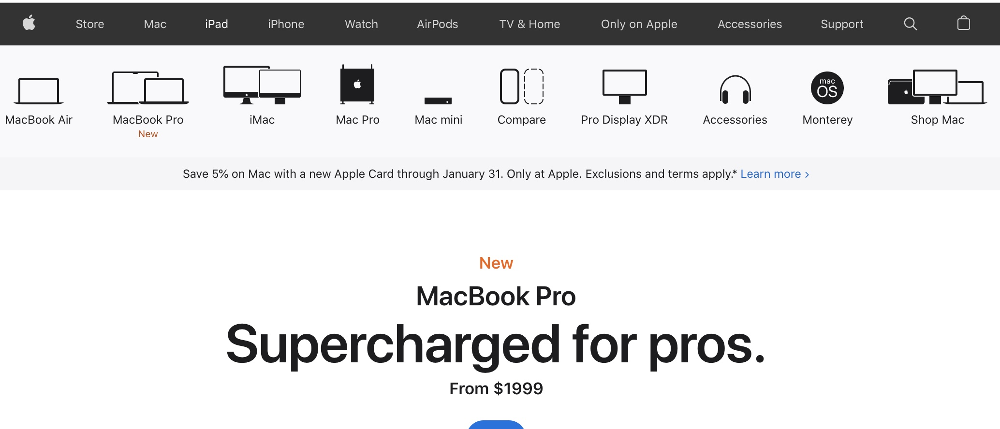

Here is the situation we find ourselves in. Our client, a *small* company in the North West United States named **Apple**, has asked us to identify all visits that have used a menu-item-name as a value in the search feature on the site. They want us to do a segmentation analysis between these users and all other users of the site. 

{width=100%}

We take a few minutes to look at the site and notice there are **a lot** of menu-item-names This is going to be a segment with a lot of rules. We quickly come up with an idea using R to scrape the site of all the menu-item-names and then create the segment using Adobe Analytics API v2.0.

The R packages, `rvest` and `adobeanaltyicsr`, can be used in tandem to help us win the day and be **the heroes**, delivering an efficient solution to the client.

Here are the steps to get this done:

1. [Authenticate and load the packages](#first)
2. [Scrape the site to gather the search terms](#second)
3. [Create the segment rules (segment predicates)](#third)
4. [Build the segment](#fourth)
5. [Grab some coffee](#fifth)

## 1. Authenticate And Load the Packages {#first}

The client wants the products.  Well you are familiar with the site enough to know that they have data attributes in the site elements. this should be enough of a start to get things going.

```{r, warning=FALSE, echo=FALSE, message=FALSE, include=FALSE}
library(rvest)
library(tidyverse)
## We are using a dev version of adobeanalyticsr
#devtools::install_github('benrwoodard/adobeanalyticsr', ref = 'segment_build')
library(adobeanalyticsr)
```

Authenticating just got better in the new version of the [adobeanalyticsr package](https://adobeanalyticsr.com).  Using the new JWT authentication process does not require you to login, like that of its brother authentication process, OAuth. This means you simply point the variables to the correct `private.key` file and you can start pulling data.  

Starting in [`adobeanaltyicsr` v0.2.1](/post/2022-01-03-adobeanalyticsr-v0-2-1-what-s-new/) you can now use this function to authenticate.

```{r authenticate, warning=FALSE, echo=TRUE, message=TRUE, include=TRUE}
aw_auth('oauth')
```

## 2. Scrape the site to gather the search terms. {#second}

It doesn't take long of getting into the digital analyst role before you realize clients are usually lacking in the data they want you to use.  This made up client is no different. While they want you to use the list of menu-item-names, they don't have a list of the terms yet. This means you are going ot have to figure out a way of collecting them.

We can use the `rvest` package to grab all the menu navigation links.  
```{r scrapetheweb, warning=FALSE, echo=TRUE, message=FALSE, include=TRUE}
#identify the URL
url <- 'https://www.apple.com/'

#scrape all the 'data-analytics-title' element attribute values
searchterms <- rvest::read_html(url) %>%
  rvest::html_elements('ul li a') %>%
  rvest::html_attr('data-analytics-title') %>%
  na.omit()
#25 of the 74 terms
head(searchterms, 25)
```

Well that was pretty simple. There may be some minor cleanup but overall we have what we are needing to create the segment rules.  There are `r length(searchterms)` search terms we will need to use in our segment.

## 3. Create the segment rules {#third}

Now that we have the `r length(searchterms)` search terms we needed we can get started on creating the segment.  This will include any visits that have used any of these terms.  Let's make sure we have identified the key dimension that captures the search term used in searches on the site.

First we need to pull the list of site dimensions using the `aw_get_dimensions()` function:

```{r}
#Pull the dimensions
dims <- aw_get_dimensions()
```

Once we have that list we need to narrow down the `r nrow(dims)` different dimensions to the one we are looking for. We know that our dimension includes the word "search" in it so we do a quick `filter` function and pass a `grepl` as the argument value to select all dimension names that include the word 'search'.

```{r}
#Filter the dimensions to find any that include the term "search"
knitr::kable(dims %>% 
  filter(grepl('search', name, ignore.case = T)) %>%
  select(id, name, description)
)
```

Looks like we can choose `evar2` or `prop2.`  Let's go with `evar2`.  Also, note that there is a "Search Keyword" dimension but we don't want that because it is specific to Natural Search traffic.  

This has been a cause for confusion and actually one of the reasons for this article.  A co-worker created a 125 keyword list segment but instead of using the "Search Term" dimension he used the "Search Keyword" dimension. After discovering the error he had to go back and recreate the segment definition, recreating all 125 different rules.

So, now that we have identified `evar2` as the appropriate dimension we want to setup our function to create all our rules or, as we will call them, predicates.

An adobe segment line item rule is really just a predicate. It contains a `subject`, `linking verb`, and `predicate nominative`.  Our `predicate nominative` is the 74 menu-item-terms that we scraped from the site.  We will use a `map()` function from the `purrr` package to apply each of the different keywords to the `seg_rule()` function.

The great part of the Adobe segment builder tool/API is that we can either collect all these into a comma delimited list along with the "eq-any-of" or "contains-any-of" verbs or we can create each rule separately. We are choosing her to create each one individually. 

```{r}
#create the list of rules/predicates
preds <- purrr:::map(searchterms, function(x) {
  adobeanalyticsr::seg_rule(dimension = 'evar2', 
                            verb = 'streq',
                            object = x,
                            validate = F) 
  })


```

## 4. Build the segment {#fourth}

Once we have the predicates built we can add them to the segment building function called `seg_build`.  This function builds the JSON string needed for the API to then build a new segment. 

Using the API forces us to be more intentional when creating a segment.  We must include a `name` and `description` for each segment. Taking a little time to consider a good name and description for the segment will go a long way in using that segment in the intended reports and analyses of the future.  

We also must include the `context` and `conjunction`.  Remember that our client was asking about the 'visits' not 'visitors' or 'hits'.  In addition, they wanted to group any visit that included any of the terms. These two simple arguments are very important when considering what conclusions can be drawn from the data.  

Finally, we have the `predicates` argument. This is a 'list' of rules that we created using the previous function. 

The response gives us the confirmation that we need to use the segment id in our future API calls.  

```{r}
#build the segments with the list of predicates created
res <- adobeanalyticsr::seg_build(name = 'Apple Search Term Segment',
                                  description = 'This segment includes a list of 74 search terms we want to see if users use as a search value',
                                  context = 'visits',
                                  conjunction = 'or',
                                  predicates = preds)

#the result will show the id and other information
res
```

Once completed we will have the final segment built and ready to be used. 

{width=100%}
*It's hard for me to show the whole segment because it has 74 unique rules but this is a screenshot of the top 9 rules.*

## 5. Grab some coffee {#fifth}

While this is a made up story, it is based on a true example of how we have been able to use the Adobe Analytics API v2.0 to help cut development time and build efficiency into our workflows.  In addition, using the API enables us to keep the naming conventions consistent across the different segments we create for a specific project.

There is still more development needed before the segment build function will be moved from the development version of adobeanalyticsr but if you have a segment building use case and would like some help in getting the solution, don't hesitate to reach out!
