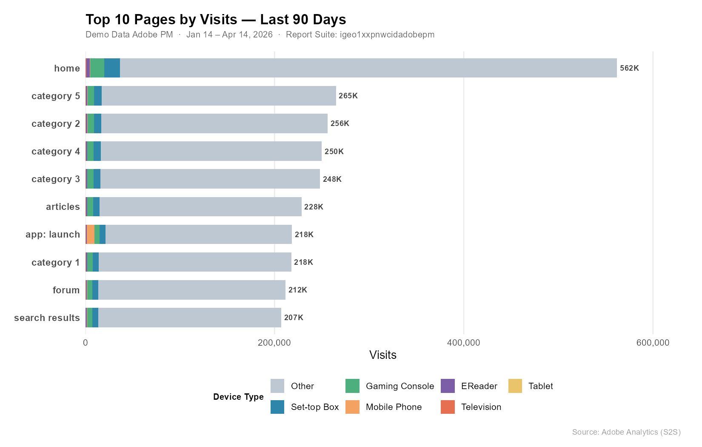

```{r setup, include=FALSE}
knitr::opts_chunk$set(
  warning = FALSE,
  message = FALSE,
  echo    = TRUE,
  eval    = FALSE
)
```

## What is MCP?

Model Context Protocol (MCP) is an open standard that lets AI assistants like Claude connect directly to external tools and data sources. Instead of copying data into a chat window, MCP gives the AI a live connection to APIs — so you can ask questions in plain English and get real answers back from your actual systems.

For Adobe Analytics, this means I can ask *"show me the top 10 pages by visits broken down by device type for the last 90 days"* and get a live, structured result — no manual API calls, no copy-paste. The MCP server I built on top of `adobeanalyticsr` handles the auth, query construction, and response formatting automatically.

This post walks through a real session: four natural language prompts, four live Adobe Analytics operations.

---

## Setup

The MCP server authenticates via Adobe's Server-to-Server (S2S) OAuth — no browser login required, making it well-suited for automated or shared workflows. All env vars are set in the MCP server configuration; the R session picks them up automatically.

```{r libraries}
suppressPackageStartupMessages({
  library(adobeanalyticsr)
  library(jsonlite)
  library(dplyr)
  library(tidyr)
  library(scales)
  library(knitr)
  library(ggplot2)
})

aw_auth_with("s2s")
aw_auth()

COMPANY_ID <- Sys.getenv("AW_COMPANY_ID")
RSID       <- "igeo1xxpnwcidadobepm"
DATE_END   <- Sys.Date()
DATE_START <- DATE_END - 90
DATE_RANGE <- as.Date(c(DATE_START, DATE_END))
```

---

## Prompt 1 — "List the report suites"

The first thing Claude does when connecting is discover what report suites are available. One API call, one table.

```{r list-report-suites}
suites <- aw_get_reportsuites(
  company_id = COMPANY_ID,
  limit      = 100,
  page       = 0
)

suites |>
  select(rsid, name) |>
  kable(col.names = c("RSID", "Name"))
```

**Result:**

| RSID | Name |
|------|------|
| `igeo1xxpnwcidadobepm` | Demo Data Adobe PM |

---

## Prompt 2 — "Top 10 pages by visits broken down by device type for the last 90 days"

A two-dimension freeform table — page × device type — sorted by visits descending. The `aw_freeform_table()` call handles the nested dimension query automatically.

```{r run-report}
raw <- aw_freeform_table(
  company_id          = COMPANY_ID,
  rsid                = RSID,
  date_range          = DATE_RANGE,
  dimensions          = c("page", "mobiledevicetype"),
  metrics             = "visits",
  top                 = 10,
  metricSort          = "desc",
  include_unspecified = FALSE,
  prettynames         = FALSE,
  check_components    = TRUE,
  debug               = FALSE
)
```

Pivoting to wide format makes the device breakdown much easier to read:

```{r results-table}
device_order <- c("Other", "Set-top Box", "Gaming Console",
                  "Mobile Phone", "EReader", "Television", "Tablet")

wide <- raw |>
  mutate(mobiledevicetype = factor(mobiledevicetype, levels = device_order)) |>
  pivot_wider(names_from = mobiledevicetype, values_from = visits, values_fill = 0) |>
  select(page, any_of(device_order)) |>
  mutate(Total = rowSums(across(where(is.numeric)))) |>
  arrange(desc(Total)) |>
  mutate(across(where(is.numeric), ~ comma(.x, accuracy = 1)))

device_cols <- intersect(device_order, colnames(wide))
kable(wide, col.names = c("Page", device_cols, "Total"),
      align = c("l", rep("r", length(device_cols) + 1)))
```

**Result:**

| Page | Other | Set-top Box | Gaming Console | Mobile Phone | EReader | Television | Tablet | Total |
|------|------:|------------:|---------------:|-------------:|--------:|-----------:|-------:|------:|
| home | 525,217 | 16,671 | 14,836 | 717 | 3,433 | 1,054 | 7 | 561,935 |
| category 5 | 247,620 | 7,902 | 7,000 | 189 | 1,576 | 524 | 2 | 264,813 |
| category 2 | 239,353 | 7,597 | 6,818 | 179 | 1,538 | 498 | 2 | 255,985 |
| category 4 | 233,749 | 7,448 | 6,578 | 166 | 1,516 | 474 | — | 249,931 |
| category 3 | 231,821 | 7,384 | 6,506 | 160 | 1,475 | 463 | — | 247,809 |
| articles | 213,514 | 6,814 | 6,103 | 283 | 1,295 | 455 | 4 | 228,468 |
| category 1 | 203,403 | 6,505 | 5,846 | 144 | 1,322 | 411 | — | 217,631 |
| forum | 197,726 | 6,261 | 5,610 | 269 | 1,246 | 385 | 6 | 211,503 |
| app: launch | 196,995 | 6,191 | 5,535 | 7,815 | 1,231 | 364 | 75 | 218,206 |
| search results | 193,610 | 6,026 | 5,523 | 262 | 1,285 | 362 | 4 | 207,072 |

---

## Prompt 3 — "Create a ggplot to help tell the story"

```{r ggplot, fig.width=11, fig.height=7}
device_colors <- c(
  "Other"          = "#BEC8D2",
  "Set-top Box"    = "#2E86AB",
  "Gaming Console" = "#4CAF7D",
  "Mobile Phone"   = "#F4A261",
  "EReader"        = "#7B5EA7",
  "Television"     = "#E76F51",
  "Tablet"         = "#E9C46A"
)

page_order <- raw |>
  group_by(page) |> summarise(total = sum(visits), .groups = "drop") |>
  arrange(total) |> pull(page)

page_totals <- raw |>
  group_by(page) |> summarise(total = sum(visits), .groups = "drop")

plot_data <- raw |>
  mutate(
    page             = factor(page, levels = page_order),
    mobiledevicetype = factor(mobiledevicetype, levels = device_order)
  )

ggplot(plot_data, aes(x = visits, y = page, fill = mobiledevicetype)) +
  geom_col(width = 0.7) +
  geom_text(
    data = page_totals,
    aes(x = total, y = factor(page, levels = page_order),
        label = paste0(comma(round(total / 1000)), "K")),
    inherit.aes = FALSE, hjust = -0.15, size = 3.2,
    color = "#444444", fontface = "bold"
  ) +
  scale_x_continuous(labels = label_comma(),
                     expand = expansion(mult = c(0, 0.12))) +
  scale_fill_manual(values = device_colors, breaks = device_order, drop = FALSE) +
  labs(title    = "Top 10 Pages by Visits — Last 90 Days",
       subtitle = paste0("Demo Data Adobe PM  ·  ",
                         format(DATE_START, "%b %d"), " – ",
                         format(DATE_END, "%b %d, %Y")),
       x = "Visits", y = NULL, fill = "Device Type",
       caption = "Source: Adobe Analytics (S2S)") +
  theme_minimal(base_size = 13) +
  theme(
    plot.title         = element_text(face = "bold", size = 16, margin = margin(b = 4)),
    plot.subtitle      = element_text(color = "#666666", size = 10, margin = margin(b = 14)),
    plot.caption       = element_text(color = "#999999", size = 9, margin = margin(t = 10)),
    panel.grid.major.y = element_blank(),
    panel.grid.minor   = element_blank(),
    axis.text.y        = element_text(face = "bold", size = 11),
    legend.position    = "bottom",
    legend.title       = element_text(face = "bold", size = 10),
    plot.margin        = margin(16, 24, 12, 16)
  )
```



A few things jump out:

- **Home dominates** — 562K visits, nearly 2× the next closest page.
- **"Other" (desktop/unclassified)** is the primary device on every page, which is typical for this kind of content property.
- **app: launch** is the outlier — Mobile Phone visits spike here compared to all other pages, reflecting genuine mobile app traffic hitting a launch screen.
- The category and content pages cluster tightly between 207K–265K, suggesting fairly even organic distribution across the site's content sections.

---

## Prompt 4 — "Create a calculated metric: Pageview Inflation (pageviews × 1.3)"

This is where it gets interesting. The use case: your team's tag audit estimates ~23% under-measurement due to ad blockers and tag-firing gaps. Multiplying pageviews by 1.3 lets you project total likely traffic alongside the tracked number — without touching raw data.

### The Formula Discovery Problem

`adobeanalyticsr`'s `cm_formula()` only accepts metric API IDs, not numeric constants. Trying `"static-number"` or `"constant"` as the `func` type both return a 400 from the API:

```
Validator Message: Unrecognized function: static-number
Validator Message: Unrecognized function: constant
```

The fix: reverse-engineer an existing calculated metric that already uses a constant multiplier. Fetching its `definition` via the raw API reveals the correct structure:

```{r inspect-formula}
existing <- adobeanalyticsr:::aw_call_api(
  req_path   = "calculatedmetrics/cm300010142_69dea0fee890ff46b39a2409?expansion=definition",
  company_id = COMPANY_ID
)
defn <- fromJSON(existing)$definition$formula
cat(toJSON(defn, auto_unbox = TRUE, pretty = TRUE))
```

```json
{
  "func": "multiply",
  "col1": {
    "func": "metric",
    "name": "metrics/pageviews",
    "description": "Page Views"
  },
  "col2": {
    "func": "col-sum",
    "description": "Column Sum",
    "col": 1.3
  }
}
```

The constant `1.3` is expressed as `col-sum` applied to a scalar — `col-sum` of a single number just returns that number, so it acts as a constant in the formula. Not obvious from the docs, but confirmed from the API itself.

### Create the Metric

```{r create-cm}
inflation_formula <- list(
  func = "multiply",
  col1 = list(func = "metric", name = "metrics/pageviews", description = "Page Views"),
  col2 = list(func = "col-sum", description = "Column Sum", col = 1.3)
)

cm_result <- cm_build(
  name        = "Pageview Inflation",
  description = "Inflates each pageview by a factor of 1.3 (pageviews × 1.3)",
  formula     = inflation_formula,
  polarity    = "positive",
  precision   = 1,
  type        = "decimal",
  create_cm   = TRUE,
  rsid        = RSID,
  company_id  = COMPANY_ID
)
```

**Result:** CM ID `cm300010142_69dea34a3af98727595af5c5` created successfully.

### Actual vs. Projected — Top 10 Pages

```{r inflation-report}
CM_ID <- "cm300010142_69dea34a3af98727595af5c5"

inflation_report <- aw_freeform_table(
  company_id          = COMPANY_ID,
  rsid                = RSID,
  date_range          = DATE_RANGE,
  dimensions          = "page",
  metrics             = c("pageviews", CM_ID),
  top                 = 10,
  metricSort          = "desc",
  include_unspecified = FALSE,
  prettynames         = FALSE,
  check_components    = FALSE,
  debug               = FALSE
)
```

```{r inflation-plot, fig.width=11, fig.height=7}
plot_inflation <- inflation_report |>
  rename(Actual = pageviews, Projected = !!sym(CM_ID)) |>
  pivot_longer(c(Actual, Projected), names_to = "Measure", values_to = "Pageviews") |>
  mutate(
    page    = factor(page, levels = inflation_report |> arrange(pageviews) |> pull(page)),
    Measure = factor(Measure, levels = c("Projected", "Actual"))
  )

ggplot(plot_inflation, aes(x = Pageviews, y = page, fill = Measure)) +
  geom_col(position = position_dodge(width = 0.65), width = 0.55) +
  scale_x_continuous(labels = label_comma(), expand = expansion(mult = c(0, 0.1))) +
  scale_fill_manual(values = c("Actual" = "#2E86AB", "Projected" = "#F4A261"),
                    breaks = c("Actual", "Projected")) +
  labs(title    = "Actual vs. Projected Pageviews — Top 10 Pages",
       subtitle = "Projected = Actual × 1.3",
       x = "Pageviews", y = NULL, fill = NULL,
       caption = "Source: Adobe Analytics (S2S) · Pageview Inflation CM") +
  theme_minimal(base_size = 13) +
  theme(
    plot.title         = element_text(face = "bold", size = 16, margin = margin(b = 4)),
    plot.subtitle      = element_text(color = "#666666", size = 10, margin = margin(b = 14)),
    plot.caption       = element_text(color = "#999999", size = 9, margin = margin(t = 10)),
    panel.grid.major.y = element_blank(),
    panel.grid.minor   = element_blank(),
    axis.text.y        = element_text(face = "bold", size = 11),
    legend.position    = "top",
    legend.justification = "left",
    plot.margin        = margin(16, 24, 12, 16)
  )
```

The 30% gap is uniform across all pages since we used a global multiplier. In practice you'd apply **page-specific inflation factors** — pages with heavy single-page-app routing tend to fire tags less reliably, so their gap is larger than pages with standard full-page loads.

---

## Wrapping Up

Four natural language prompts, four live Adobe Analytics operations — no manual API construction, no token juggling, no copy-paste. The MCP server handles the plumbing; Claude handles the translation between intent and API call.

The calculated metric piece is a good example of where the AI adds real value beyond simple query execution: when the documented API approach failed, it reverse-engineered the correct formula structure from an existing object in the system. That's the kind of adaptive problem-solving that makes this more than a query runner.

The full MCP server code is at [benrwoodard/aa_mcp](https://github.com/benrwoodard/aa_mcp_test) and the `adobeanalyticsr` package that powers it is on [CRAN](https://cran.r-project.org/package=adobeanalyticsr).
